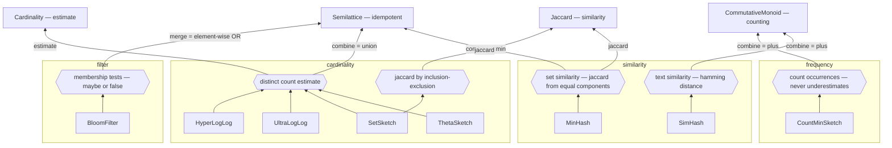

# schrodinger

> Sometimes you just can't hold all of those cats in RAM, so you need to start guessing how many there are.

This project contains implementations of probabilistic data structures in scala, integrating with cats and checking their laws.

It also contains instances and tests for well known JVM probabilistic data structures, so that you can use them easily with cats, and confirm they meet the expected laws.

## Abstractions

The core module defines the interfaces everything plugs into:

* `Hasher[I, O]` and `HasherFactory[Seed, I, O]` — a single hash function, and a seeded *family* of them. The seed picks the variant, which is how sketches get many independent hash functions.
* `HashTruncator[Input, Width]` / `HashShifter[Input, Width]` — cut a hash down to `Width` bits (low bits as a `BitVector`, or keep the top bits numerically).
* `QuantumBoolean` — three-valued logic (`True` / `Maybe` / `False`), the result type of bloom filter membership.
* `SimilarityHash[T]` — a mergeable sketch that can be built from a stream of hashes; extends cats `Semilattice`.
* `Cardinality[T]` — anything that can estimate how many distinct items it has seen.
* `Jaccard[T]` — anything that can estimate the Jaccard similarity of two sketches.

## The shape of the library

Every sketch sits on one of two algebras, and the split is the point:

* **Idempotent — a `Semilattice`.** Merging the same sketch twice changes nothing. These represent *sets*: the minhash family, the theta sketch, SetSketch, the bloom filter, and both hash4j cardinality sketches.
* **Counting — a `CommutativeMonoid`.** Merging adds counters, so repetition is information. These represent *multisets*: Count-Min (frequencies) and SimHash (text similarity). A semilattice cannot represent frequencies; that is why the counting family exists.

The capabilities then compose: a cardinality sketch that merges as a union can estimate Jaccard by inclusion-exclusion for free — see `Jaccard.fromCardinalityAndSemilattice`.

Bottom-up inside each family box: implementations feed the operations (hexagons), which merge (labeled edges) into the cats algebras and implement the core capability interfaces (`Cardinality`, `Jaccard`). `MinHash` stands for the four simple variants plus the hash4j wrapper; `SetSketch` is the one type on two operations — distinct counting and inclusion-exclusion jaccard.

## Included Data Types (Simple Module)

Teaching implementations, written to be as clear as possible rather than fast.

### Set similarity (minhash family)

| Type | Provides |
|---|---|
| `SimpleMinHash[HashCount]` | the vanilla algorithm: one hash per component, keep the smallest |
| `SimpleVariableMinHash[HashCount, HashWidth]` | hashes truncated to `HashWidth` bits |
| `SimpleVariableMinHash64[HashCount, HashWidth]` | 64-bit hashes, compact scodec serialization |
| `SimplePRNGMinHash[HashCount, HashWidth]` | one hash feeds a seeded PRNG — the "fast" variant |

All provide `SimilarityHash` (union = element-wise min) and `Jaccard` (fraction of equal components).

### Text similarity

| Type | Provides |
|---|---|
| `SimpleSimHash[Components, Input]` | `CommutativeMonoid` (vote tallies merge by addition), `signature`, `hammingDistance`, `similarity` |

### Cardinality

| Type | Provides |
|---|---|
| `SimpleThetaSketch[LgK]` | `BoundedSemilattice` + `Cardinality`; exact while small, sampled after |
| `SimpleSetSketch[LgK]` | `BoundedSemilattice` + `Cardinality` + `Jaccard` (inclusion-exclusion); closed-form estimator, no empirical tables |

### Filter

| Type | Provides |
|---|---|
| `SimpleBloomFilter[Bits, Input]` | `QuantumBoolean` membership, `BoundedSemilattice` (merge = element-wise OR) |

### Frequency

| Type | Provides |
|---|---|
| `SimpleCountMinSketch[Rows, Width, Input]` | `CommutativeMonoid`; `query` never underestimates a frequency |

## hash4j integration

Instances for dynatrace's production sketches, usable with cats:

* `MinHash[Components]` — `SimilarityHash` + `Jaccard` (bit width 64)
* `UltraLogLog` — `BoundedSemilattice` + `Cardinality`
* `HyperLogLog` — `BoundedSemilattice` + `Cardinality`
* `wyhashFinal4` / `wyhashFinal4Factory` — wyhash as a `Hasher` / `HasherFactory`

## Law testing

Every instance is checked with munit `DisciplineSuite` law sets (`similarityHash`, `boundedSemilattice`, `commutativeMonoid`, `jaccard`), cross-compiled on Scala 2.13 and 3.3.
